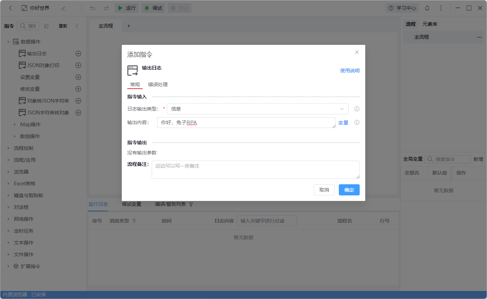
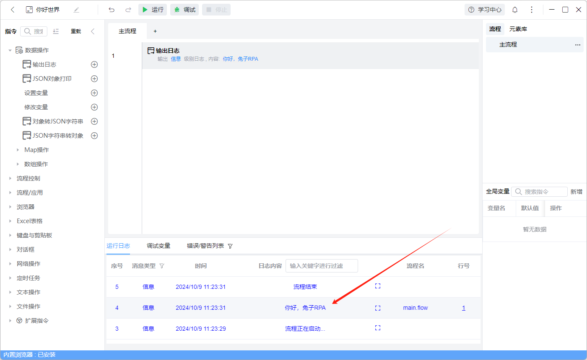

# 创建一个应用

## 1. 打开 tuzi RPA 注册登录 点击首页 新建应用 输入应用名称 选择应用类型 点击创建应用

## 2. 点编辑 进入应用 开发页面， 通过左侧指令区拖入或双击指令、点击加号 即可添加一条指令，我们双击输出日志指令


在输出内容中输入 你好，兔子 RPA 即可输出 你好，兔子 RPA 到日志面板中。
操作会自动保存，可以撤销或重做。

## 3. 点击运行按钮，即可运行应用，运行日志会显示输出日志面板中。



下面是此列子的完整代码：
复制下面的代码到 tuzi RPA 编辑器中，粘贴即可

```
//tuziRpaNobwRAdghgtgpmAXGAJlALlACgJwPYDGcAzsQJYQDmAdADZ6W4XpgA0qZxADrVAJ4A5WAmSBk+MBfioFPTQOv6bMGQJ4ISeYogBaAO5wARuoI44GBO04BhJeny0kAMyi1icU8QsQreWgFEIKOw6d2RRh4dxUJAAIAEhBaOAA3OFoAXwjAcr9AaiUZCNYIwFDFQE7tRGiQNXQ4d2S5Ci4AV3RiJHA4xJtEcGh4FRakuXiHWpF5CFs8ORROHn4VQEP5QHsDOXQ+LiHiKwpKOSgUFDdbMk32sEMAR1qyQz9EK0H2Xh1e5BkJQG8fQGj1ReXVpLgCFnY8Fx0GQlI1EKAwPdHmB5n0BkMKKMwMlWM0oA82mBAMAxgFXouG0QYqFC6WqbFFojEqQBm0YApFXxhOQmigOGU5Mh6OhgExUwD30fShnAcPgcMiALrsYn2Wq0dAANXhKkRY3YwK4Kme4kyyJRYDKFRYR06Q0AgZESQAhboU+SpAAbygF9NQAw/4AVRUACtoAJSwAEFPisVGscBstjs9gcmuzKWJxBb2FMiAALTzE4XIQDv0aJAKaKJvE5oKXqG5QAHphDFBxnBJdK5QShosyKrwxbkg2AfU6g0mtqANZwPg+vhrOAwahoTC4QgkchUOgMJhhdj2MgEwwAZSsxko3eQ5RwMAoxmqVzAUAAjMfbABWQ8EU8ABgvABZbLeAJzoh+2AiPgAcAHYiEfz6e5GCUJ0EXONNHCcQIgAHm4KAIAiAheFIABeAAdMB+j9dE4nQgA+eYoIAelgiBcPSLJpByfIimgkiEKQ4g0Iw5kyGwuA8NtR1XQ9IiSNwuQBSFFQ5C4FAABl4mURArxcAAxeN/EcOBkhFIA

```
